# Using Google Cloud Pub/Sub as Celery's message broker

Hello, world!

On today’s article, I’m going to show you how to use Google Cloud Pub/Sub as Celery’s message broker. This is a very simple and straightforward process, but it can be a little bit tricky if you’re not familiar with Google Cloud’s services.

First of all, lets configure our Python environment.

## Setting up the Python environment

For package management, I'm using [uv](https://docs.astral.sh/uv/) from [astral](https://astral.sh/), which is, in my opinion, the current best option both in terms of speed and functionality. Let's start out by creating a new Python project.

```sh
uv init celery-pubsub
cd celery-pubsub
uv sync
```

Now let's install the required packages.

As of the time I'm writing this (March 16th, 2025), using Pub/Sub as a message broker is still in release candidate status, and was introduced through [this pull request in Celery](https://github.com/celery/celery/pull/9351) and [this other pull request in Kombu](https://github.com/celery/kombu/pull/2147) - which is Celery's messaging library. So we need to not only install packages allowing for pre-release versions, but on top of that, Celery itself does not have an extra package for Google Cloud Pub/Sub available in PyPI, only Kombu does. So, we need to install some specific versions of the packages.

While we're at it, let's also install Celery's Google Cloud Storage extra package, to use Storage's buckets as a result backend. This is not in any way mandatory.

```sh
uv add 'kombu[gcpubsub]==5.5.0'
uv add 'celery[gcs]==5.5.0rc5'
```

Keep in mind that the versions I'm using here are the latest available at the time of writing. [This issue](https://github.com/celery/celery/issues/9140) covers the roadmap for Celery's v5.5.0 release, which is the one that includes the Pub/Sub support. The maintainers are planning to release it by the last week of March, so depending on when you're reading this, you might need to adjust the versions, and not rely on pre-releases anymore.

## Setting up Google Cloud Platform's project

In order to make use of Google Cloud Pub/Sub, we need to do some preparation. For the sake of simplicity, authentication will be left out as an exercise for the reader, but it is pretty straightforward, and you can check out [the official documentation](https://cloud.google.com/docs/authentication/gcloud) for more information on how to do it.

### Creating a new project

Go to the [Google Cloud Console](https://console.cloud.google.com/), and create a new project. I'm going to name mine `celery-pubsub`.

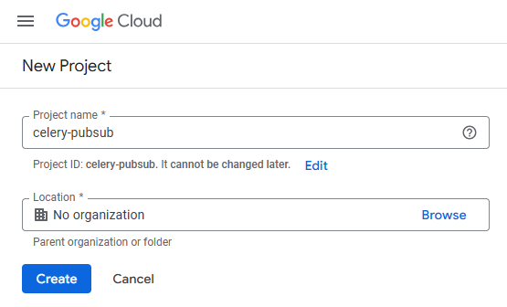

### Google Cloud Pub/Sub

Now, go to [Pub/Sub](https://console.cloud.google.com/cloudpubsub)'s homepage to enable the API. The platform will automatically enable it for you once you visit this address.

### Firestore

The same goes to [Firestore](https://console.cloud.google.com/firestore), which is required by Celery in order to allow for native [Chords](https://docs.celeryq.dev/en/latest/userguide/canvas.html#chords) reference counting.

Along with enabling Firestore's API, you will need a default database. You can create one by clicking on the "Create database" button on the [databases](https://console.cloud.google.com/firestore/databases) page.

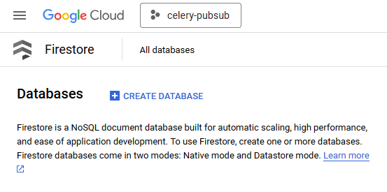

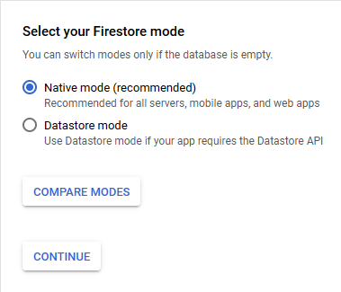

Here, I'm selecting `southamerica-east1` as my region. You can choose the region that best suits your needs.

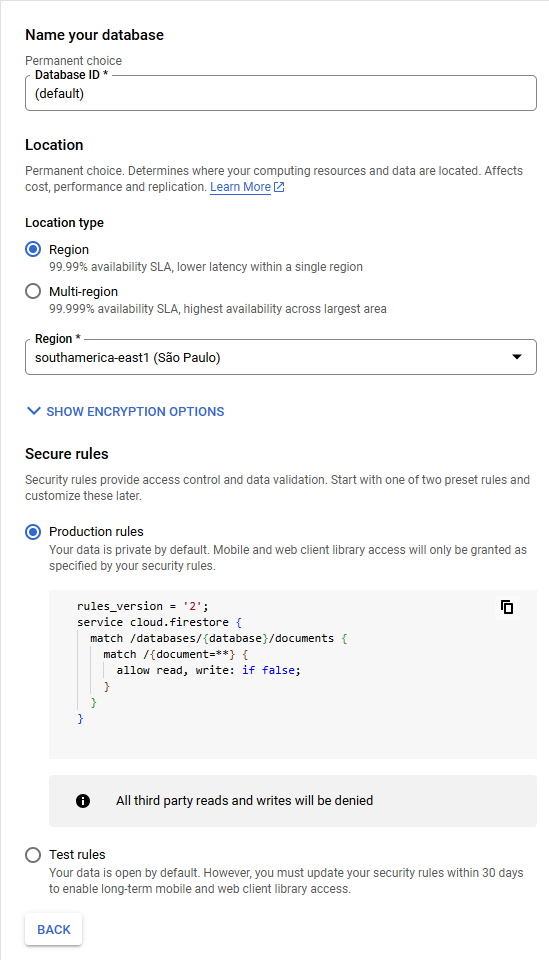

Once the database is created, you should see it listed on Firestore's homepage.

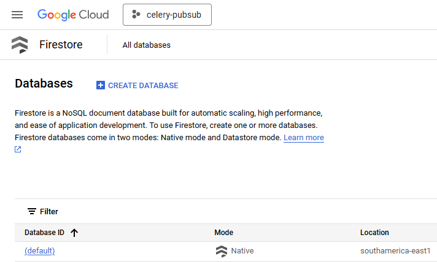

The last configuration we need to do is set up Firestore's time to live policy. This will be used by Celery in order to properly expire chord keys. Click on the `(default)` database you just created and go to "Time-to-live (TTL)" on the left sidebar.

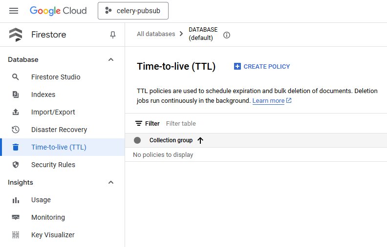

Click on "Create policy" and set the collection group to `celery` and the timestamp field to `expires_at`. This is not currently documented by Celery, but you can see the relevant code [here](https://github.com/celery/celery/blob/main/celery/backends/gcs.py#L160-L352).

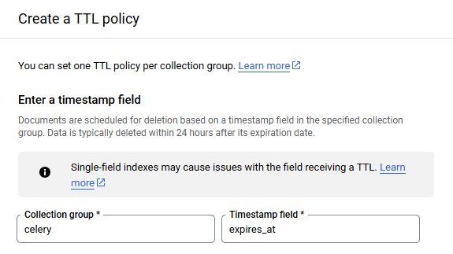

### Google Cloud Storage

Now let's create a bucket that will be used to store the results of our tasks. Go to [Storage, in the buckets tab](https://console.cloud.google.com/storage/browser), and click on the "Create" button.

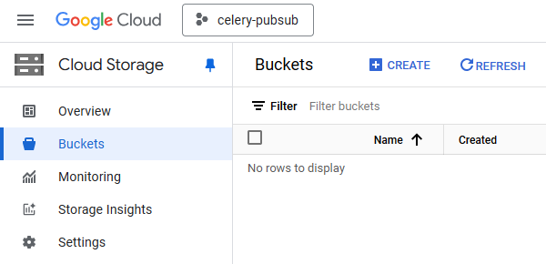

My bucket is named `celery-result-backend`, and I'm selecting `southamerica-east1` as the location. You can choose the location that best suits your needs. The rest of the configurations can be left as default.

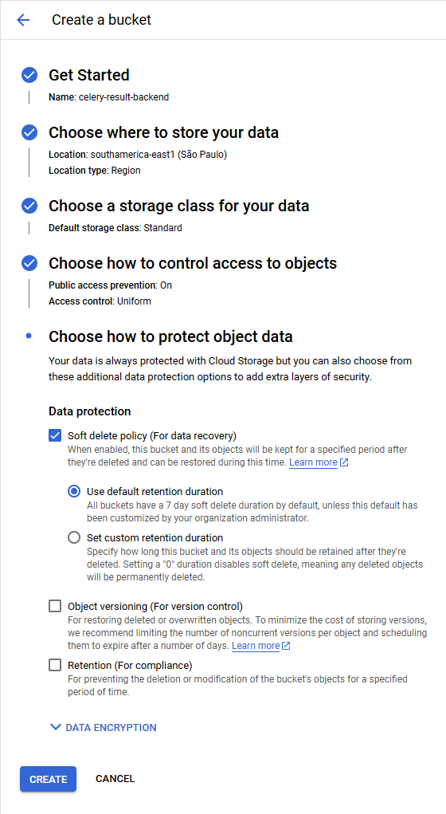

You may be presented with a pop-up telling you that public access will be prevented. This is a good thing, we don't want unauthorized access to our Celery task's results. Just click "Confirm".

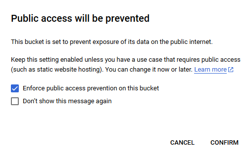

Phew! That was a lot of setup, but we're finally ready to write some code.

## Creating the celery application

On the root of your project, created with uv, you will see that there is a file named `hello.py`. Open it and declare your Celery application.

```python
from celery import Celery

app = Celery(
    "celery-pubsub",
    broker="gcpubsub://projects/celery-pubsub",
    backend="gs://celery-result-backend/tasks?gcs_project=celery-pubsub",
)

@app.task
def hello():
    return "hello"
```

The syntax for the broker and backend URLs is pretty straightforward. For the broker, you need to specify the project name, and for the backend, you need to specify the bucket name and the project name. The `gcs_project` parameter is required for the backend URL, and it should be the same as the project name. If you're following along with this article, you can copy and paste the code above keeping the same names. If not, the structure is as follows:

```python
PROJECT_NAME = "your-project-name"  # in my case, "celery-pubsub"
BUCKET_NAME = "your-bucket-name"  # in my case, "celery-result-backend"
PATH_TO_STORE_RESULTS = "your-path-to-store-results"  # in my case, "tasks"

broker = f"gcpubsub://projects/{PROJECT_NAME}"
backend = f"gs://{BUCKET_NAME}/{PATH_TO_STORE_RESULTS}?gcs_project={PROJECT_NAME}"
```

I also created a task named `hello`, which simply returns the string "hello". This should be enough to test if everything is working as expected.

So, spin up a worker by running the following command:

```sh
uv run celery -A hello worker --loglevel=INFO
```

And then, on another terminal, let's spawn a Python REPL and call the task.

```sh
uv run python
```

```python
>>> from hello import hello
>>> result = hello.delay()
>>> result.get()
'hello'
```

If we did everything correctly, we should see the string "hello" being printed on the worker's terminal, as well as the Python shell.

```sh
# from the worker's terminal
[2025-03-16 19:51:07,425: INFO/MainProcess] Task hello.hello[2c486b9c-c1df-4b5f-907d-5a64231da8bf] received
[2025-03-16 19:51:08,385: INFO/ForkPoolWorker-1] Task hello.hello[2c486b9c-c1df-4b5f-907d-5a64231da8bf] succeeded in 0.9595536249998986s: 'hello'
```

You can also check the task result in the bucket you created. You should see a file inside the folder named `tasks` (or whatever you named it) with the task's result.

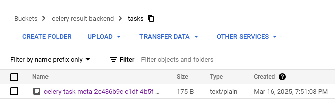

And that's it! You're now using Google Cloud Pub/Sub as Celery's message broker.
